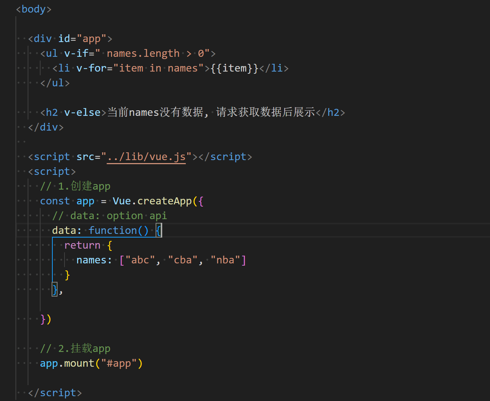
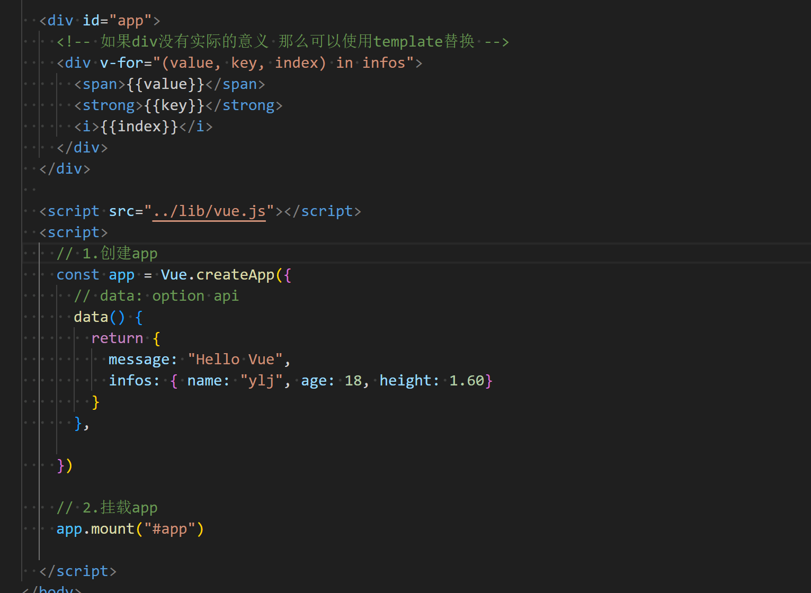
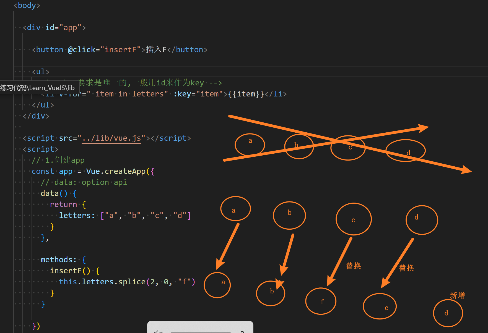
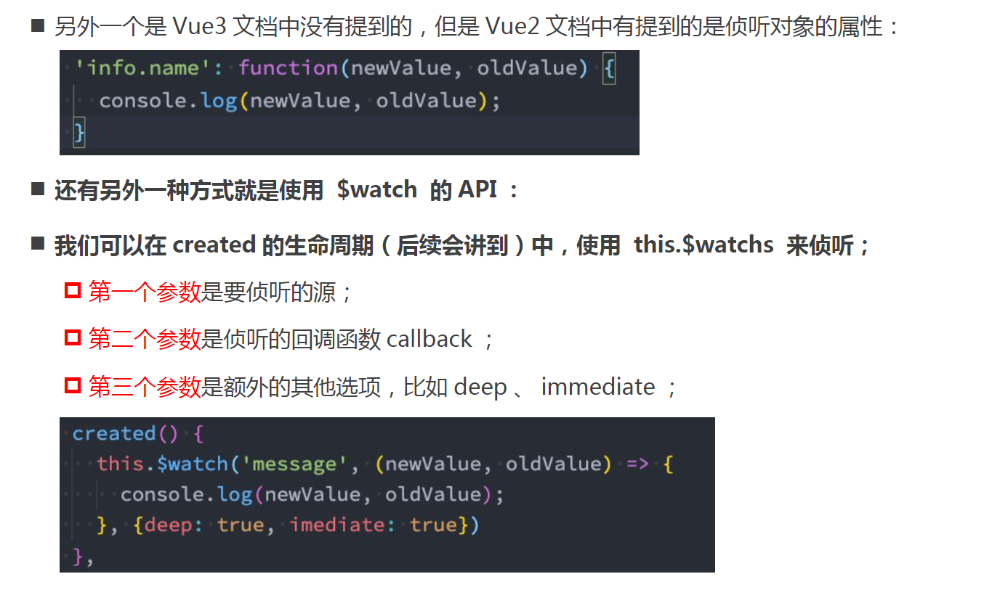
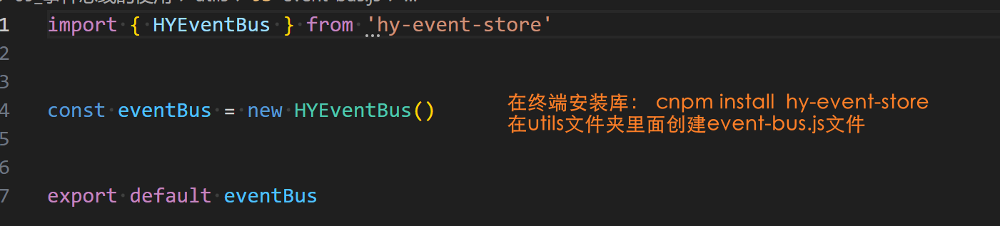
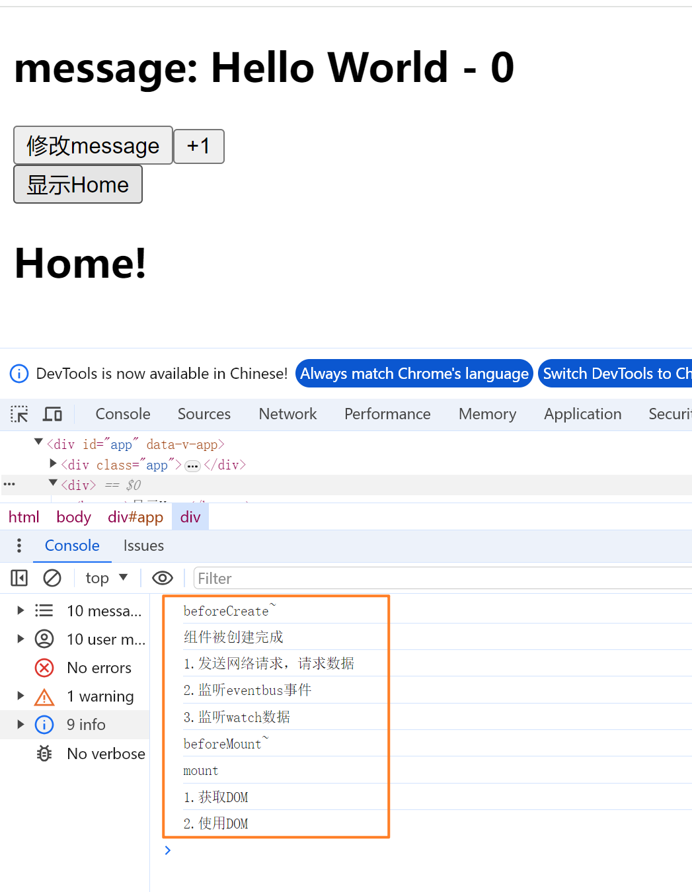
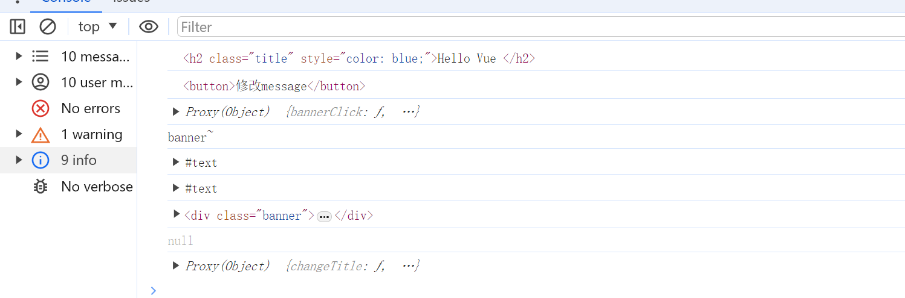

# Vue(一)

## 邂逅Vue.js开发

### 一、Vue在前重要性

#### 1.1.认识Vue

- vue是一套构建用户界面的渐进式JavaScript框架
  - 全称vue.js /vuejs
  - 它基于标准 HTML 、 CSS 和 JavaScript 构建，并提供了一套声明式的、组件化的编程模型；
  - 帮助高效开发用户界面，无论任务是简单还是复杂；
- vue的本质就是javascript的库  相当于一个封装好的库  在项目中可以引入并且使用他即可


#### 1.2.框架

- vue  react  ....
- vue非常重要  一定一定要学好
- 找前端的工作：优先推荐 JavaScript （ TypeScript ）、其次 Flutter 、再次
  Android （ Java 、 Kotlin ）、 iOS （ OC 、 Swift ）；
- 就前端来说，学习了 HTML 、 CSS 、 JavaScript ，哪一个框架更容易找到工作？
  - 如果去国外找工作，优先推荐 React 、其次是 Vue 和 Angular ；
  - 如果在国内找工作，优先推荐、必须学习 Vue ，其次是 React ，其次是 Angular ；


### 二、Vue2和Vue3选择

#### 2.1.优先选择vue3


### 三、引入Vue的方式

#### 3.1.如何使用vue

#####  3.1.1.方式一： cdn

- ```
  <body>
  
    <h2>哈哈哈</h2>
    <p>哈哈哈哈哈</p>
  
    <div id="app"></div>
  
    <!-- CDN地址 -->
    //这个网址已过期
    <!-- <script src="https://unpkg.com/vue@next"></script> -->
    
    <script src="https://unpkg.zhimg.com/vue@next"></script>
  
   
    <script>
  
      //使用vue
      const app = Vue.createApp({
        template: `<h2>Hello World</h2> <span>呵呵呵呵</span>`
      })
      //mount:挂载
      app.mount("#app")
  
    </script>
  
  
  </body>
  ```
  
- 效果

  - 


##### 3.1.2.引入方式二:下载Vue的JavaScript文件并且自己手动引入

- ```
  <body>
  
    <h2>哈哈哈</h2>
    <p>哈哈哈哈哈</p>
  
    <div id="app"></div>
  
    <script src="./lib/vue.js"></script>
  
    <script>
  
      //使用vue
  
      //1.创建app
      const app = Vue.createApp({
        template: `<h1>Hello Vue</h1> <span>呵呵呵呵我是内容</span>`
      })
  
      //2.挂载app
      //mount:挂载
      app.mount("#app")
  
  
    </script>
  
  
  </body>
  ```

- 

##### 3.1.3.方式三:通过npm包管理工具安装使用他

- ```
  npm install vue
  要使用vue
  import "vue"
  ```

##### 3.1.4.方式四: 直接通过Vue CLI创建项目 并且使用他


### 四、Vue案例初体验

#### 4.1.案例一:动态数据

- ```
  <body>
  
    <div id="app"></div>
  
  
    <script src="./lib/vue.js"></script>
    <script>
      
     
     
      const app = Vue.createApp({
        //插值语法: {{title}}
        template: `<h1>{{message}}</h1>`,
        data: function () {
          return {
            title: "hello world",
            message: "你好啊 Vue"
          }
        }
      })
  
      app.mount("#app")
  
    </script>
  
  
  </body>
  ```


#### 4.2.案例二:列表数据的展示

- ```
  <body>
    
    <div id="app"> </div>
  
    <script src="./lib/vue.js"></script>
    <script>
  
      const app = Vue.createApp({
        template: `
        <h2>{{movies}}</h2>
        <ul>
          <li v-for="item in movies">{{item}}</li>
        </ul>
        `,
        data : function() {
          return {
            message:  "你好啊 Vue",
            movies: ["大话西游", "星际穿越", "盗梦空间", "少年派", "飞驰人生", "那个不为人知的故事"]
          }
        }
        
      })
  
      app.mount("#app")
  
  
    </script>
  
  
  </body>
  ```

- 

#### 4.3.案例三:计数器功能

- ```
  <body>
  
    <div id="app"></div>
    
    <script src="./lib/vue.js"></script>
    <script>
  
      const app = Vue.createApp({
        template:`
        <h2>当前计数:{{counter}}</h2>
        <button @click="increment">+1</button>
        <button @click="decrement">-1</button>
        `,
        data: function() {
          return {
            counter: 0
          }
        },
        methods: {
          increment: function() {
           this.counter++
          },
          decrement: function() {
            this.counter--
          }
        }
  
      })
      app.mount("#app")
  
    </script>
  </body>
  ```

- 

- 对上述代码的重构
- 

- 原生实现计数器功能

- ```
  <body>
  
    <h2>当前计数:<span></span></h2>
    <button class="add">+1</button>
    <button class="sub">-1</button>
  
    <script>
  
      //1.获取doc
      const h2El = document.querySelector("h2")
      const spanEl = document.querySelector("span")
      const addEl = document.querySelector(".add")
      const subEl = document.querySelector(".sub")
  
      //2.定义一个变量来动态的改变counter
      let counter = 100
      spanEl.textContent = counter 
  
      //3.监听点击 gaibian counter
      addEl.onclick = function() {
        counter++
        spanEl.textContent = counter
      }
  
      subEl.onclick = function() {
        counter--
        spanEl.textContent = counter
      }
  
    </script>
    
  </body>
  ```

  

### 五、命令和声明式编程(了解)

#### 5.1.声明式和命令式

- 

#### 5.2.MVVM模型

- 


### 六、Vue的options

#### 6.1.data属性

- data属性传入的是一个函数 并且该函数需要返回一个对象

- 练习

  - ```
    <body>
      
      <div  id="app">
        <h2>{{message}}</h2>
        <button @click="changeMessage">改变Message</button>
      </div>
      
      <script src="./lib/vue.js"></script>
      <script>
    
        const app = Vue.createApp({
          
          //data要是一个函数 并且函数需要有一个返回值
          data: function() {
            return {
              message: "Helllo World!"
            }
          },
          methods: {
            changeMessage: function() {
              this.message = "你好 世界！"
            }
          }
       
        })
        app.mount("#app")
    
      </script>
    </body>
    ```


#### 6.2.methods属性

- methods属性是一个对象  
- 


#### 6.3.其他属性

- props  
- computed
- watch
- emits
- setup等
- 这些后续学


## Vue基础-模板语法(一)

### 一、Mustache语法

#### 1.1.VSCode代码片段

- 

- 

#### 1.2.模板语法

- React 的开发模式：
  -  React 使用的 jsx ，所以对应的代码都是编写的类似于 js 的一种语法；
  -  之后通过 Babel 将 jsx 编译成 React.createElement 函数调用；
-  Vue 也支持 jsx 的开发模式（后续有时间也会讲到）：
  -  但是大多数情况下，使用基于 HTML 的模板语法；
  -  在模板中，允许开发者以声明式的方式将 DOM 和底层组件实例的数据绑定在一起；
  -  在底层的实现中， Vue 将模板编译成虚拟 DOM 渲染函数，这个我会在后续给大家讲到；
  -  所以，对于学习 Vue 来说，学习模板语法是非常重要的。


#### 1.3.Mustache双大括号语法(掌握)

- {{}}

- ```
  <body>
  
    <div id="app">
      <!-- 插值的基本使用 -->
      <h2>{{message}}</h2>
      <h2>当前计数: {{ counter }}</h2>
      <!--2.表达式  -->
      <h2>计数双倍: {{ counter * 2 }}</h2>
      <h2>展示字符串: {{ infos.split(" ") }}</h2>
  
      <!-- 3.三元运算符 -->
       <h2>{{ age >= 18? "成年人":"未成年人"}}</h2>
  
       <!-- 4.调用methods中的函数 -->
        <h2>{{ formatDate(time) }}</h2>
  
       <!-- 5.注意:这里不能定义语句 -->
        <!-- <h2>{{const name = "ylj" }}</h2> -->
  
    </div>
    
    <script src="../lib/vue.js"></script>
    <script>
      // 1.创建app
      const app = Vue.createApp({
        // data: option api
        data: function() {
          return {
            message: "Hello Vue",
            counter: 0,
            infos: "my name is ylj",
            age: 22,
            time: 123
          }
        },
        methods: {
          formatDate: function(date) {
            return "2024-10-28-" + date
          }
        }
  
      })
  
      // 2.挂载app
      app.mount("#app")
  
    </script>
  </body>
  ```

- 


### 二、常见的基本指令

#### 2.1.v-once指令（了解）

- 当数据发生变化时，元素或者组件异界其所有子元素将是为静态内容视为静态内并且跳过（只渲染一次）
- 该指令可以用于性能优化


#### 2.2.v-text指令（了解）

- 


#### 2.3.v-html指令（了解）

- 


#### 2.4.v-pre指令使用

- 用于跳过元素和他的子元素的编译过程 显示原始的Mustache标签
  - 跳过不需要编译的节点 加快编译的速度
- 

- 

#### 2.5.v-cloak(斗篷)指令使用(了解)

- 这个指令保持在元素上直到关联组件实例结束编译。
-  和 CSS 规则如 [v-cloak] { display: none } 一起用时，这个指令可以隐藏未编译的 Mustache 标签直到组件实例准备完毕

- 

#### 2.5.v-memo(后续会详细讲解)

- 


### 三、v-bind绑定属性

- 前面讲的一系列指令主要是将值插入到模板内容中
- 除了内容需要动态来决定还希望某些属性也能动态绑定
  - 比如a元素中的href属性
  - img中的src属性
- 绑定属性使用 v-bind(了解)
  - 缩写:   :
  - 预期: any(with argument) Object(without argument)
  - 参数 attrOrProp(optional)
  - 修饰符: 
    - .camel -将kebab-case attribute名转换为camelCase
  - 用法: 动态绑定一个或多个attribute或一个组件prop到表达式

- ```
  
    <div id="app">
    
      <button @click="changeImg">切换图片</button>
    
      <!-- 1.绑定img中的src属性 -->
       
    
       <!-- 2.绑定a的href属性 -->
        <a v-bind:href="href">百度一下</a>
        
     </div>
    
    <script src="../lib/vue.js"></script>
    <script>
      // 1.创建app
      const app = Vue.createApp({
        // data: option api
        data: function() {
          return {
            imgUrl1: "http://p1.music.126.net/4XJSMDwCuHd-c3ABe4C1ag==/109951170084327809.jpg",
            imgUrl2: "http://p1.music.126.net/nEUrRDy1x1oa1cI-d-qsRg==/109951170084918882.jpg",
      
            showImg: "http://p1.music.126.net/4XJSMDwCuHd-c3ABe4C1ag==/109951170084327809.jpg",
            href: "http://www.baidu.com"
          }
        },
      
        methods: {
          changeImg: function(){
            this.showImg = this.showImg === this.imgUrl1? this.imgUrl2: this.imgUrl1
          }
        }
      
      })
      
      // 2.挂载app
      app.mount("#app")
      
    </script>


#### 3.2.绑定基本属性

- v-bind用于绑定一个或多个属性值 或向另一个组件传递props值->后续学到组件再学
- 开发中还有很多属性或类等等需要绑定
- v-bind还有个语法糖(就是简写的甜头)写法 ->  :


### 四、绑定class和style

#### 4.1.绑定class介绍

-  在开发中，有时候我们的元素 class 也是动态的
  - 当数据为某个状态时，字体显示红色。
  -  当数据另一个状态时，字体显示黑色。
-  绑定 class 有两种方式：
  -  对象语法
  -  数组语法

- 

- 


#### 4.2.绑定style的介绍

- 我们可以利用 v-bind:style 来绑定一些 CSS 内联样式：
  - 这次因为某些样式我们需要根据数据动态来决定；
  - 比如某段文字的颜色，大小等等；
  -  CSS property 名可以用驼峰式 (camelCase) 或短横线分隔 (kebab-case ，记得用引号括起来 ) 来命名；
- 绑定 class 有两种方式：
  - 对象语法
    - 
  -  数组语法
    - 


#### 4.3.动态绑定属性(了解)

- 在某些情况下，我们属性的名称可能也不是固定的：
  - 前面我们无论绑定 src 、 href 、 class 、 style ，属性名称都是固定的；
  -  如果属性名称不是固定的，我们可以使用 :[ 属性名 ]=“ 值” 的格式来定义；
  -  这种绑定的方式，我们称之为动态绑定属性；

- 


#### 4.4.绑定对象

- 

- 


### 五、v-on绑定事件

#### 5.1.v-on的用法

- 缩写： @
- 


#### 5.2.v-on的基本使用

- 

- 


#### 5.2.v-on传递参数

-  当通过 methods 中定义方法，以供 @click 调用时，需要注意参数问题：
  - 情况一：如果该方法不需要额外参数，那么方法后的 () 可以不添加。
  -  但是注意：如果方法本身中有一个参数，那么会默认将原生事件 event 参数传递进去
  - 情况二：如果需要同时传入某个参数，同时需要 event 时，可以通过 $event 传入事件。

- 

- 在模板中想要明确的获取(event对象: $event) 
  - 


#### 5.3.v-on修饰符(了解)

-  .stop - 调用 event.stopPropagation() 。
-  .prevent - 调用 event.preventDefault() 。
-  .capture - 添加事件侦听器时使用 capture 模式。
-  .self - 只当事件是从侦听器绑定的元素本身触发时才触发回调。
-  .{keyAlias} - 仅当事件是从特定键触发时才触发回调。
-  .once - 只触发一次回调。
-  .left - 只当点击鼠标左键时触发。
-  .right - 只当点击鼠标右键时触发。
-  .middle - 只当点击鼠标中键时触发。
-  .passive - { passive: true } 模式添加侦听器


### 六、Vue的条件渲染

#### 6.1.条件渲染

-  在某些情况下，需要根据当前的条件决定某些元素或组件是否渲染，这个时候就需要进行条件判断了。
-  Vue 提供了下面的指令来进行条件判断：
  - v-if
    -  v-if 的渲染原理：
      - v-if 是惰性的；
      -  当条件为 false 时，其判断的内容完全不会被渲染或者会被销毁掉；
      -  当条件为 true 时，才会真正渲染条件块中的内容；
  - v-else
    - 
  - v-else-if
    - 
  - v-show
    - 用法和v-if是一致的  也是根据一个条件来决定是否显示元素或者组件


#### 6.2.v-if和v-show的区别

- 用法上的区别
  - v-show不能和template一起使用
  - v-show也不能和v-else一起使用
- 本质
  - v-show无论元素是否显示在DOM上都存在 他只是通过改变display属性来进行切换
  - v-if当条件为false时就会消失 不会渲染到DOM上
- 选择v-show还是v-if 
  - 如果需要频繁切换显示和隐藏之间  就使用v-show  这样可以避免回流和重绘
  - 如果使用v-if就可能会发生回流和重绘 因为会不断添加到DOM中又从DOM中消失
  - 如果不会频繁就使用v-if


#### 6.3.template

- vue2就需要包裹一个div 参考03 --> 现在引用一个template元素 不显示的时候template元素也会消失 不需要再对该元素进行维护

- 


#### 6.4.条件渲染案例

- 


## Vue基础-模版语法(二)

### 一、v-for列表渲染

#### 1.1.v-for的基本使用

- v-for的基本格式 ： item in 数组
  - 数组通常是来自data或者prop 也可以是其他方式
  - item是我们给每项元素起的一个别名 这个可以自定义

- 在遍历一个数组的时候想要拿到数组的索引值
  - 格式： （item index） in 数组
  - 注意： 数组元素项item是在前  索引项是在后
- 基本案例
  - 

- 


### 二、v-for渲染类型

#### 2.1.数组类型

- 

- 

#### 2.2.其他类型

- 对象
- 字符串
- 数字
- 

#### 2.3.v-for和template

- 


### 三、数组更新的检测

#### 3.1.数组更新检测

- 方法
  
  -  这些被包裹过的方法包括：
  
    - push()
    - pop()
    - shift()
    -  unshift()
    -  splice()
    -  sort()
    -  reverse()
  
  - 替换数组的方法
  
    - 上面的方法会直接修改原来的数组；
    -  但是某些方法不会替换原来的数组，而是会生成新的数组，比如 filter() 、 concat() 和 slice() ；
  
  - ```
    <body>
    
      <div id="app">
        <ul>
          <!-- 也支持of -->
          <!-- <li v-for=" item of names"> {{item}}</li> -->
          <li v-for=" item in names"> {{item}}</li>
        </ul>
    
        <button @click="changeNames">修改数组</button>
      </div>
      
      <script src="../lib/vue.js"></script>
      <script>
        // 1.创建app
        const app = Vue.createApp({
          // data: option api
          data() {
            return {
              names: ["abc", "cba", "nba", "bsd", "csd"]
            }
          },
          methods: {
            changeNames() {
              //1.直接将数组修改为一个新的数组
              // this.names = ["kobe", "james"]
    
              //2.通过一些数据的方法 修改数组中的元素
              //增加
              // this.names.push("ylj")
              //减少
              // this.names.pop()
              //第一个参数：从第几个索引开始  第二个参数：删除几个  第三个参数：替换成什么
              // this.names.splice(2,1,"yyy")
              //排序
              // this.names.sort()
              //反转
              // this.names.reverse()
    
              //3.不修改原数组的方法是不能侦听的
              //下述返回的是一个新的数组 固不能修改原数组 因为对原数组没有进行修改只是在原数组上增加一些
              //要呈现新的  应该要重新赋值
              const newNames = this.names.map(item => item + "ylj")
              this.names = newNames
    
            }
          }
    
        })
    
        // 2.挂载app
        app.mount("#app")
    
      </script>
    ```
  
  - 
  

#### 3.2.v-for中key的作用

- 


### 四、v-for的key属性

#### 4.1.认识VNode

- VNode: Virtual Node 虚拟节点
- VNode 的本质是一个 JavaScript 的对象
- 


### 五、Vue的虚拟DOM

#### 5.1.虚拟DOM

- 

### 六、v-for的diff算法(后续)

#### 6.1.有无key的diff算法

- #### key的作用

  - 案例

    - ```
      <body>
      
        <div id="app">
      
          <button @click="insertF">插入F</button>
      
          <ul>
            <!-- key要求是唯一的,一般用id来作为key -->
            <li v-for=" item in letters" :key="item">{{item}}</li>
          </ul>
        </div>
        
        <script src="../lib/vue.js"></script>
        <script>
          // 1.创建app
          const app = Vue.createApp({
            // data: option api
            data() {
              return {
                letters: ["a", "b", "c", "d"]
              }
            },
      
            methods: {
              insertF() {
                this.letters.splice(2, 0, "f")
              }
            }
      
          })
      
          // 2.挂载app
          app.mount("#app")
      
        </script>
      </body>
      ```

  - 没有绑定key的时候,下列案例渲染过程是
    - 一是全部销毁重新渲染
    - 二是前面一样的保存下来后续不一样的全部替换  比如c换成f ,d换成c,e换成d....
    - 这样导致性能很低    
    - 

  - 因此每次遍历for都要绑定key,最好是id
  - 绑定key后上述的案例渲染过程(key的diff算法)
    - 


## Vue基础-Option API

### 一、computed计算属性使用

#### 1.1.复杂data的处理方式

- 方式一:插值语法	

  - ```
    <body>
    
      <div id="app">
        <!-- 插值语法表达式直接进行拼接 -->
        <!-- 1.拼接姓名 -->
        <h2>{{ firstName + " " + lastName }}</h2>
        <h2>{{ firstName }} {{ lastName }}</h2>
    
        <!-- 2.显示分数等级 -->
         <h2>{{ score >= 60? '及格':'不及格'}}</h2>
    
         <!-- 3.反转单词显示文本 -->
          <h2>{{ message.split(" ").reverse().join(" ") }}</h2>
    
      </div>
      
      <script src="../lib/vue.js"></script>
      <script>
        // 1.创建app
        const app = Vue.createApp({
          // data: option api
          data() {
            return {
              //1.姓名
              firstName: "kobe",
              lastName: "bryant",
    
              //2.分数: 及格/不及格
              score: 80,
    
              //3.一串文本: 对文本中的单词进行反转显示
              message: "my name is ylj"
            }
          },
    
        })
    
        // 2.挂载app
        app.mount("#app")
    
      </script>
    </body>
    ```

- 方式二:methods方法

  - ```
    <body>
    
      <div id="app">
        <!-- methods方式进行拼接 -->
        <!-- 1.拼接姓名 -->
        <h2>{{ getFullname() }}</h2>
        <h2>{{  getFullname() }}</h2>
    
        <!-- 2.显示分数等级 -->
         <h2>{{ getScoreLevel()}}</h2>
    
         <!-- 3.反转单词显示文本 -->
          <h2>{{ reverseMessage() }}</h2>
    
      </div>
      
      <script src="../lib/vue.js"></script>
      <script>
        // 1.创建app
        const app = Vue.createApp({
          // data: option api
          data() {
            return {
              //1.姓名
              firstName: "kobe",
              lastName: "bryant",
    
              //2.分数: 及格/不及格
              score: 80,
    
              //3.一串文本: 对文本中的单词进行反转显示
              message: "my name is ylj"
            }
          },
          methods: {
            getFullname() {
              return this.firstName + " " + this.lastName
            },
            getScoreLevel() {
              return this.score >= 60? '及格':'不及格'
            },
            reverseMessage() {
              return this.message.split(" ").reverse().join(" ")
            }
          }
    
        })
    
        // 2.挂载app
        app.mount("#app")
    
      </script>
    </body>
    ```

- 方式三:计算属性方法

  - ```
    <body>
    
      <div id="app">
        <!-- methods方式进行拼接 -->
        <!-- 1.拼接姓名 -->
        <h2>{{ fullName }}</h2>
        <h2>{{ fullName  }}</h2>
    
        <!-- 2.显示分数等级 -->
         <h2>{{ scoreLevel }}</h2>
    
         <!-- 3.反转单词显示文本 -->
          <h2>{{ reverseMessage }}</h2>
    
      </div>
      
      <script src="../lib/vue.js"></script>
      <script>
        // 1.创建app
        const app = Vue.createApp({
          // data: option api
          data() {
            return {
              //1.姓名
              firstName: "kobe",
              lastName: "bryant",
    
              //2.分数: 及格/不及格
              score: 80,
    
              //3.一串文本: 对文本中的单词进行反转显示
              message: "my name is ylj"
            }
          },
          computed: {
            fullName() {
              return this.firstName + " " + this.lastName
            },
    
            scoreLevel() {
              return this.score >= 60? "及格":"不及格"
            },
    
            reverseMessage() {
              return this.message.split().reverse().join(" ")
            }
    
          }
      
    
        })
    
        // 2.挂载app
        app.mount("#app")
    
      </script>
    </body>
    ```


#### 1.2.认识计算属性computed

- 对于任何包含响应式数据的复杂逻辑，你都应该使用计算属性

-  计算属性将被混入到组件实例中

  - 所有 getter 和 setter 的 this 上下文自动地绑定为组件实例；

- 计算属性的用法：

  - 选项： computed

  - 类型： { [key: string]: Function | { get: Function, set: Function } }

  - ```
    computed: {
            fullName() {
              return this.firstName + " " + this.lastName
            },
    
            scoreLevel() {
              return this.score >= 60? "及格":"不及格"
            },
    
            reverseMessage() {
              return this.message.split().reverse().join(" ")
            }
    
          }
    ```

  - 


### 二、computed和method区别

#### 2.1.区别

- 计算属性会进行缓存,methods方法是不会缓存,如果同一个代码运行多次   计算属性只会运行一次而methods方法会运行多次
- 


### 三、computed的set和get

#### 2.2.计算属性的缓存

- 计算熟悉会基于他们的依赖关系进行缓存
- 在数据不发生变化时 计算属性是不需要重新计算的
- 如果依赖的数据发生变化 在使用时 计算属性依然会重新进行计算
- 

#### 2.3.计算属性的setter和getter方法

- ```
  <body>
  
    <div id="app">
      <h2>{{fullName}}</h2>
  
      <button @click="setFullname">修改Fullname按钮</button>
    </div>
    
    <script src="../lib/vue.js"></script>
    <script>
      // 1.创建app
      const app = Vue.createApp({
        // data: option api
        data() {
          return {
            firstName: "kobe",
            lastName: "bryant",
          }
        },
       
        computed: {
          //语法糖的写法
          // fullName() {
          //   console.log("computed fullname------")
          //   return this.firstName + " " + this.lastName
          // },
  
          //上述完整写法如下 
          fullName: {
            get: function() {
              return this.firstName + " " + this.lastName
            },
            set: function(value) {
              const names = value.split(" ")
              this.firstName = names[0]
              this.lastName = names[1]
            }
          }
          
        },
        methods: {
          setFullname() {
            this.fullName = "kobe ylj"
          }
        },
  
      })
  
      // 2.挂载app
      app.mount("#app")
  
    </script>
  </body>
  ```

- 


### 四、侦听器watch选项使用

#### 4.1.认识侦听器watch

- 在data返回的对象中定义了数据 这个数据通过插值语法等方式绑定到template中

- 当数据变化时 template会自动进行更新来显示新的数据

- 这个时候就可以通过watch进行侦听新的数据或旧的数据

- ```
  <body>
  
    <div id="app">
      <h2>{{message}}</h2>
      <button @click="changeMessage">修改messagee按钮</button>
    </div>
    
    <script src="../lib/vue.js"></script>
    <script>
      // 1.创建app
      const app = Vue.createApp({
        // data: option api
        data() {
          return {
            message: "Hello Vue",
            info: { name: "kobe", age: 18}
          }
        },
        methods: {
          changeMessage() {
            this.message = "你好 李银河"
            this.info = { name: "ylj"}
          }
        },
        watch: {
          message(newValue, oldVule) {
            console.log("message 发生了变化",newValue, oldVule)
          },
          info(newValue, oldVule) {
            //2.如果是对象类型,那么拿到的是代理对象
            // console.log("info发生了改变", newValue, oldVule)
            // console.log(newValue.name, oldVule.name)
  
            //3.获取原生对象
            // console.log({ ...newValue })
            console.log(Vue.toRaw(newValue))
          }
        }
  
      })
  
      // 2.挂载app
      app.mount("#app")
  
    </script>
  </body>
  ```

- 


#### 4.2.侦听器watch的配置选项-深度监听

- 上述案例只能监听到浅层的变化

- 如果监听的是一个对象里面的属性 上述就无法监听到

- 要进行深度监听必须加一个属性 deep: true

- 

- ```
  <body>
  
    <div id="app">
      <h2>{{info.name}}</h2>
      <button @click="changeMessage">按钮</button>
    </div>
    
    <script src="../lib/vue.js"></script>
    <script>
      // 1.创建app
      const app = Vue.createApp({
        // data: option api
        data() {
          return {
            info: { name: "ylj", age: 18}
          }
        },
        methods: {
          changeMessage() {
            this.info.name = "kobe"
          }
        },
        watch: {
          //默认watch监听不会进行深度监听
          // info() {
          //   console.log("info发生了改变")
          // }
  
          //进行深度监听
          info: {
            handler(newValue, oldVule) { 
              console.log("侦听到info改变", newValue, oldVule)
              console.log(newValue === oldVule)
            },
            //监听器选项
            //info进行深度监听
            deep: true,
            //第一次渲染直接执行一次监听器
            immediate: true,
          },
  
          "info.name": function( newValue, oldVule ) {
            console.log("name发生了改变")
          }
        }
  
      })
  
      // 2.挂载app
      app.mount("#app")
  
    </script>
  </body>
  ```

- 


### 五、侦听器watch其他写法

#### 5.1.侦听器watch的其他方式(了解)

- 
- 


### 六、阶段性综合案例练习

#### 6.1书籍购物车需求

- 


#### 6.2.案例思路

- 先搭建基本样式

  - 回顾表格写法

  - ```
    <table>
    	<thead>
    		<tr>
    			<th></th>
    		</tr>
    	</thead>
    	<tbody>
    		<tr>
    			<td></td>
    		</tr>		
    	</tbody>
    </table>
    ```

  - 

  - 

  - 只要使用到v-for就要绑定 key 一般key的值都为id

- 再对样式进行调试

- 接着对功能挨个添加

  - 按钮+
    - @click="increment(index)"
    - 在methods中 -> increment(index) { this.books[index].count++}
  - 按钮-
    - 第一 和上述按钮+一样
    - 第二:当数字为1的时候这个按钮-应该禁用  -> 绑定 :disabled=" item.length <= 1"

- 然后对移除操作 -> removeBook 

  - 在methods方法中 removeBook(index) { this.books.splice(index, 1) }

- 最后对总价

  - 方法 totalPrice() { let proce = 0  for( const item of books) { price + = item.price * item.count   return price }}
  - 对价格进行封装  formatPrice(price) { return "￥" + price}
  - 调用 {{  formatPrice(totalPrice) }}


## Vue基础- v-model表单

### 一、model基本使用

#### 1.1.基本使用

- 

- ```
  <body>
  
    <div id="app">
      <!-- 1.手动实现双向绑定 -->
      <!-- <input type="text" :value="message"  @input="changeInput"> -->
  
      <!-- 2.v-model实现双向绑定 -->
      <!-- <input type="text" v-model="message"> -->
  
      <!-- 3.登录功能 -->
       <label for="account">
          账号:<input id="account" type="text" v-model="account">
       </label>
       <label for="password">
          密码:<input id="password" type="password" v-model="password">
       </label>
  
       <button @click="logClick">登录</button>
  
  
      <h2>{{message}}</h2>
    </div>
    
    <script src="../lib/vue.js"></script>
    <script>
      // 1.创建app
      const app = Vue.createApp({
        // data: option api
        data() {
          return {
            message: "Hello Vue",
            account: "",
            password: ""
          }
        },
        methods: {
          //手动实现双向绑定
          changeInput(event) {
            this.message = event.target.value
          },
  
          logClick() {
            const account = this.account
            const password = this.password
            console.log(account, password)
  
            //url发送服务器
          }
        }
  
      })
  
      // 2.挂载app
      app.mount("#app")
  
    </script>
  </body>
  ```

  

### 二、v-model绑定原理

#### 2.1.绑定原理

- 

#### 2.2.案例

- 

- 


### 三、v-model绑定radio

#### 3.1.案例

- ```
  <body>
  
    <div id="app">
        <div class="gender">
          <label for="male">
            <!-- 当绑定的是同一个属性的时候就是互斥的 (name) -->
            <input id="male" v-model="gender" type="radio" name="gender" value="male"> 男
          </label>
          <label for="female">
            <input id="male" v-model="gender" type="radio" name="gender" value="female"> 女
          </label>
          <h2>性别: {{ gender }}</h2>
        </div>
    </div>
    
    <script src="../lib/vue.js"></script>
    <script>
      // 1.创建app
      const app = Vue.createApp({
        // data: option api
        data() {
          return {
            message: "Hello Vue",
            //默认选中女
            gender: "female"
          }
        },
  
      })
  
      // 2.挂载app
      app.mount("#app")
  
    </script>
  </body>
  ```

- 


### 四、v-model绑定checkbox

#### 4.1.案例

- ```
  <body>
  
    <div id="app">
      <!-- 1.checkbox单选框: 绑定到属性中的值是一个布尔类型 -->
       <label for="agree">
          <input id="agree" type="checkbox" v-model="isAgree"> 同意协议
       </label>
  
       <h2>单选框: {{ isAgree }}</h2>
  
  
       <!-- 2.checkbox多选框 : 绑定到属性中的值是一个Array-->
       <!-- 注意: 多选框当中, 必须明确的绑定一个value值 -->
        <div class="hobbies">
          <h2>请选择您的爱好: </h2>
          <label for="sing">
            <input type="checkbox" id="sing" v-model="hobbies" value="sing "> 唱
          </label>
          <label for="dancing">
            <input type="checkbox" id="dancing" v-model="hobbies" value="dancing "> 跳
          </label>
          <label for="rap">
            <input type="checkbox" id="rap" v-model="hobbies" value="rap "> rap
          </label>
          <label for="basketball">
             <input type="checkbox"  id="basketball" v-model="hobbies" value="basketball "> 篮球
          </label>
          <h2>爱好: {{ hobbies }}</h2>
        </div>
    </div>
    
    <script src="../lib/vue.js"></script>
    <script>
      // 1.创建app
      const app = Vue.createApp({
        // data: option api
        data() {
          return {
            //即使初始化是一个值,但当选中状态改变时他就会变成布尔类型
            isAgree: true ,
            hobbies: []
          }
        },
  
      })
  
      // 2.挂载app
      app.mount("#app")
  
    </script>
  </body>
  ```

- 

### 五、v-model绑定select

#### 5.1.案例

- ```
  <body>
  
    <div id="app">
      <!-- select的单选 -->
      <select v-model="fruit" >
         <option value="apple">苹果</option>
         <option value="pear">梨</option>
         <option value="banana">香蕉</option>
      </select>
      <h2>单选: {{ fruit }}</h2>
  
      <hr>
  
      <!-- seclect的多选 -->
       <select multiple v-model="fruits"> 
        <option value="apple" >苹果</option>
        <option value="pear">梨</option>
        <option value="banana">香蕉</option>
       </select>
  
       <h2>多选: {{ fruits }}</h2>
    </div>
    
    <script src="../lib/vue.js"></script>
    <script>
      // 1.创建app
      const app = Vue.createApp({
        // data: option api
        data() {
          return {
    
            fruit: "",
            fruits: ""
          }
        },
  
      })
  
      // 2.挂载app
      app.mount("#app")
  
    </script>
  </body>
  ```

- 

#### 5.1.v-model值 的绑定

- 

- 

- 

### 六、v-model的修饰符(了解)

#### 6.1.案例

- ```
  <body>
  
    <div id="app">
      <!-- lazy: 绑定change事件   移出鼠标或者按enter键下述message才能显示输入框的内容-->
      <input type="text" v-model.lazy="message">
      <h2>message: {{message}}</h2>
  
      <!-- 2.number: 自动将内容转换成数字 -->
  
      <!-- 输入一串数字 默认为是字符串类型 -->
      <!-- <input type="text" v-model="counter"> -->
      <!-- 因此要加.number -->
      <input type="text" v-model.number="counter">
      <h2>counter: {{counter}} - {{ typeof counter }}</h2>
  
      <hr>
      <!-- 自动转换为数字类型  只能输入数字类型 -->
      <input type="number" v-model="counter2">
      <h2>counter2: {{counter2}} - {{ typeof counter2 }}</h2>
  
      <!-- 3.trim: 去除首尾的空格 -->
       <input type="text" v-model.trim="content">
       <h2>content: {{ content }} </h2>
  
       <!-- 4.使用多个修饰符 -->
       <input type="text" v-model.lazy.trim="content">
       <h2>content: {{ content }} </h2>
  
    </div>
    
    <script src="../lib/vue.js"></script>
    <script>
      // 1.创建app
      const app = Vue.createApp({
        // data: option api
        data() {
          return {
            message: "Hello Vue",
            counter: 0,
            counter2: 0,
            content: ""
          }
        },
        watch: {
          content(newValue) {
            console.log("content:", newValue)
          }
        }
  
      })
  
      // 2.挂载app
      app.mount("#app")
  
    </script>
  </body>
  ```

- 


## Vue组件化基础-脚手架

### 一、Vue组件化开发思想 

- 总的来说 将整个应用程序拆分成很多个小组件 (这些小组件可以进行复用)
- 这些小组件可以组成一颗组件树
- 

### 二、注册Vue的组件

#### 2.1.注册组件的方式

- 方式一:全局组件  -> 任何其他的组件中都能使用的组件
- 方式二: 局部组件 -> 只有在注册的组件中才能使用的组件


#### 2.2.vue的根组件使用

- ```
  <body>
  
    <div id="app">
      <h2>{{message}}</h2>
    </div>
    
    <script src="../lib/vue.js"></script>
    <script>
      //1.组件: APP组件(根组件)
      const App = {
        // data: option api
        data() {
          return {
            message: "Hello Vue"
          }
        },
  
      }
      // 1.创建app
      const app = Vue.createApp(App)
  
      // 2.挂载app
      app.mount("#app")
  
    </script>
  </body>
  ```


#### 2.3.全局组件的使用

- 只要通过app.componet()  ->都是全局组件

- 特点: 任何其他的组件中都能使用的组件

- 基本使用

- ```
  <style>
      .product {
        background-color: orange;
      }
    </style>
  </head>
  
  
  <body>
  
    <div id="app">
      <!-- 1.内容一: -->
      <product-item></product-item>
      
      <!-- 2.内容二: -->
      <product-item></product-item>
  
      <!-- 3.内容三: -->
      <product-item></product-item>
    </div>
  
  
    <!-- 组件product-item的模板 -->
    <template id="item">
      <div class="product">
        <h2>我是商品</h2>
        <div>商品图片</div>
        <div>商品价格: <span>¥9.9</span></div>
        <p>商品描述信息, 9.9秒杀</p>
      </div>
    </template>
    
    <script src="../lib/vue.js"></script>
    <script>
      /*
        1.通过app.component(组件名称, 组件的对象)
        2.在App组件的模板中, 可以直接使用product-item的组件
      */
  
      // 1.组件: App组件(根组件)
      const App = {}
  
      // 2.创建app
      const app = Vue.createApp(App)
  
      // 3.注册一个全局组件
      // product-item全局组件
      app.component("product-item", {
        template: "#item"
      })
  
      // 2.挂载app
      app.mount("#app")
    </script>
  </body>
  ```

- 


#### 2.4.全局组件的逻辑

- 有自己的data coputed methods...

- ```
  app.component("product-item", {
  template: ``,
  
  data() {
  return{}
  },
  
  computed: {},
  
  methods: { }
  })
  ```

- 案例

  - ```
      <style>
        .product {
          background-color: orange;
        }
      </style>
    </head>
    <body>
    
    
      <div id="app">
       
        <!-- 使用product-item组件 -->
    
        <!-- 内容一 -->
        <product-item></product-item>
        <!-- 内容二 -->
        <product-item></product-item>
        <!-- 内容三 -->
        <product-item></product-item>
    
        <home-nav></home-nav>
    
        <home-nav></home-nav>
    
        <home-nav></home-nav>
    
      </div>
    
      <template id="product">
        <div class="product">
          <h2>{{ title }}</h2>
          <div>商品图片</div>
          <div>商品价格: <span>￥9.9</span></div>
          <p>商品描述信息: {{ price }} 秒杀</p>
          <button @click="favarItem">收藏</button>
        </div>
      </template>
    
      <template id="nav">
        <h2>我是应用程序的导航</h2>
      </template>
      
    
      <script src="../lib/vue.js"></script>
      <script>
     
        //1.组件: App组件(根组件)
        const App = {}
    
        //2.创建app
         const app = Vue.createApp(App)
    
        //2.创建全局组件
    
        //3.1.product-item组件
        app.component("product-item", {
          template: "#product",
          data() {
            return {
              message: "hello vue!",
              title: "我是商品item",
              price: 9.9
            }
          },
          methods: {
            favarItem() {
              console.log("收藏了Item")
            }
          }
        })
    
    
        //3.2.video-item全局组件
         app.component("home-nav", {
          template: "#nav"
         })
    
        // 2.挂载app
        app.mount("#app")
    
      </script>
    </body>
    ```

  - 

#### 2.5.组件的名称

- 方式一: 使用短横线分隔符 -

  - eg: product-item

- 方式二: 使用驼峰标识符 但在template里面使用便签的时候不能使用驼峰因为html默认不区分大小写一个使用短横线

  - ```
    app.componet("ProductItem", {})
    
    <template>
    	<product-item></product-item>
    </template>
    ```

  - 


#### 2.6.注册局部组件

- 局部组件 -> 通过components属性选项来进行注册

- 案例

  ```
  <style>
      .product {
        background-color: orange;
      }
    </style>
  </head>
  <body>
  
    <div id="app">
  
  
      <product-item></product-item>
  
      <home-nav></home-nav>
  
  
    </div>
  
    <template id="product">
      <div class="product">
        <h2>{{ title }}</h2>
        <div>商品图片</div>
        <div>商品价格: <span>￥9.9</span></div>
        <p>商品描述信息: {{ price }} 秒杀</p>
        <button >收藏</button>
      </div>
      <home-nav></home-nav>
    </template>
  
  
    <template id="nav">
      <h2>我是应用程序的导航</h2>
      <!-- 是局部组件 不能使用 -->
      <product-item></product-item>
      <div>------------end-------------</div>
    </template>
    
    <script src="../lib/vue.js"></script>
    <script>
      const ProductItem = {
        template: "#product",
            data() {
              return {
                message: "hello vue!",
                title: "我是商品item",
                price: 9.9
              }
            }
      }
      // 1.创建app
      const app = Vue.createApp({
        components: {
            ProductItem,
          "home-nav" : {
              template: "#nav",
              component: {
                ProductItem
              }
            }
        },
        // data: option api
        data() {
          return {
            message: "Hello Vue"
          }
        },
  
      })
  
      // 2.挂载app
      app.mount("#app")
  
    </script>
  </body>
  ```

- 

### 三、注册Vue的布局组件

#### 3.1.布局组件注册代码

- 


### 四、Vue的开发模式解析

#### 4.1.vue的开发模式

- 目前我们使用 vue 的过程都是在 html 文件中，通过 template 编写自己的模板、脚本逻辑、样式等。
  - 随着项目越来越复杂，我们会采用组件化的方式来进行开发:这就意味着每个组件都会有自己的模板、脚本逻辑、样式等；
  - 当然我们依然可以把它们抽离到单独的 js 、 css 文件中，但是它们还是会分离开来；
  - 也包括我们的 script 是在一个全局的作用域下，很容易出现命名冲突的问题；
  -  并且我们的代码为了适配一些浏览器，必须使用 ES5 的语法；
  - 在我们编写代码完成之后，依然需要通过工具对代码进行构建、代码；
- 所以在真实开发中，我们可以通过一个后缀名为 .vue 的 single-file components ( 单文件组件 ) 来解决，并且可以使用
  webpack 或者 vite 或者 rollup 等构建工具来对其进行处理。


#### 4.2.单文件的特点

- 代码的高亮；
- ES6 、 CommonJS 的模块化能力；

- 组件作用域的 CSS (css有自己的作用域)
-  可以使用预处理器来构建更加丰富的组件，比如
  TypeScript 、 Babel 、 Less 、 Sass 等；
- 模版
  - 


#### 4.3.如何支持SFC(单文件组件)

- 使用SFC的.vue文件 常见的两种方式
  - 方式一: 使用 Vue CLI 来创建项目，项目会默认帮助我们配置好所有的配置选项，可以在其中直接使用 .vue 文件；
  - 方式二:自己使用 webpack 或 rollup 或 vite 这类打包工具，对其进行打包处理；
- 后期做项目或公司开发通常使用Vue CLI的方式来完成


### 五、Vue CLI安装和使用

#### 5.1.安装

- 全局安装

  - nom install @vue/cli

  - 检查安装是否成功 -> vue --version  -> 有显示版本

- 升级Vue CLI

  - npm update @vue/cli -g


#### 5.2.使用

- 通过Vue的命令来创建目录
  - vue create 项目名称
    - 创建的过程
    - 


### 六、Vue的项目目录分析

#### 6.1.项目目录解析

- 

- 

- **`node_modules`**
  - 这是一个文件夹，通常用于存放项目所依赖的 Node.js 模块。当你运行`npm install`时，所有的依赖模块都会被下载并保存在这个文件夹中。
- **`public`**
  - 这是一个文件夹，通常用于存放项目的静态资源文件，例如 HTML、CSS、图片等。在基于 Vue.js 或 React.js 等前端框架的项目中，这个文件夹可能包含项目的入口 HTML 文件。
- **`src`**
  - 这是一个文件夹，通常用于存放项目的源代码。在基于 Vue.js 或 React.js 等前端框架的项目中，这个文件夹会包含组件、视图、样式和业务逻辑等代码。
- **`.browserslistrc`**
  - 这是一个配置文件，用于指定项目所支持的浏览器范围。工具如 Babel 和 Autoprefixer 会使用这个文件来确定如何转换和添加浏览器前缀。
- **`.gitignore`**
  - 这是一个配置文件，用于告诉 Git 哪些文件或文件夹不需要被版本控制。例如，`node_modules`通常会被添加到`.gitignore`文件中，因为它可以通过`npm install`重新生成。
- **`babel.config.js`**
  - 这是一个 JavaScript 配置文件，用于配置 Babel。Babel 是一个 JavaScript 编译器，用于将较新的 JavaScript 语法转换为向后兼容的版本。
- **`package-lock.json`**
  - 这是一个由`npm`自动生成的文件，用于锁定项目的依赖版本。它确保在不同环境中安装的依赖版本是一致的。
- **`package.json`**
  - 这是一个 Node.js 项目的清单文件，包含项目的名称、版本、脚本、依赖等信息。当你运行`npm install`时，`npm`会根据这个文件来安装项目所需的依赖。
- **`README.md`**
  - 这是一个 Markdown 格式的文件，通常用于项目的说明文档。它可以包含项目的简介、安装指南、使用方法、API 文档等内容。
- **`vue.config.js`**
  - 这是给vscode看的  配置路径别名 可以在其他地方更方便引入路径名称且有所提示


#### 6.2.配置路径别名

- 

#### 6.3.创建vue项目

- 

- 方式一
  - 通过vuecli脚手架  ->基于webpack打包
    - 在终端输入命令: vue ctreate 项目名称
  - 通过npm init @vue/laster  ->基于vite打包
    - 上述命令的解释
    - 1.安装一个本地工具: create-vue
    - 2.使用create-vue创建一个项目


## 组件化-组件间通信

### 一、Vue组件的嵌套关系

#### 1.1.认识组件的嵌套

- 


#### 1.2.组件的通信

- 

- 开发过程中经常遇到需要组件之间相互进行通信
  - 比如多个地方需要使用header 每个地方的header展示的内容 不一样
  - 又比如在Main中一次性请求了Banner数据和ProductList数据，那么就需要传递给它们来进行展示
  - 也可能是子组件中发生了事件，需要由父组件来完成某些操作，那就需要子组件向父组件传递事件


#### 1.3.父子组件之间通信的方式

- 父组件传递给子组件: 通过props属性
  - props:是在组件上注册一些自定义的attribute
  - 父组件给这些attribute赋值  子组件通过attribute的名称来获取到对应的值
  - props常见的两种用法
    - 方式一:字符串数组
    - 方式二:对象类型
- 子组件传递给父组件: 通过$emit触发事件
- 


### 二、父组件传递子组件

#### 2.1.子组件接收父组件的属性

- 


#### 2.2.props的数组语法

- 父组件导入子组件并使用子组件元素

  - ```
    <template>
      <!-- 展示个人信息 -->
      <!-- 可以写成单标签 -> <show-info /> -->
      <show-info name="ylj" age="18" height="1.60" />
    
      <!-- 展示Kobe的个人信息 -->
      <show-info name="kobe" :age="30" :height="1.88" />
    
      <!-- 展示默认的信息 -->
      <show-info  />
    
    </template>
    
    <script>
      import ShowInfo from './Showinfo.vue'
    
      export default {
        components: {
          ShowInfo
        }
      }
    </script>
    ```

- 子组件接收父组件传递过来的参数

  - ```
    <template>
      <div class="info">
        <h2>姓名: {{ name }}</h2>
        <h2>年龄:{{ age }}</h2>
        <h2>身高: {{ height }}</h2>
      </div>
    </template>
    
    <script>
      export default {
        //接受父组件传递过来的属性
        //1.props的数组语法
        //弊端: 1> 不能对类型进行验证  2> 没有默认值
         props:["name", "age", "height"]
       }
    </script>
    ```

- 


#### 2.3.props的对象语法

- 

- ```
  <script>
    export default {
      //接受父组件传递过来的属性
      //2.props对象语法
      props: {
        name: {
          type: String,   
          default:"我是默认的name"
        },
        age:  {
          type:Number,
          default: 0
        },
        height: {
          type:Number,
          default: 2
        },
  
        showMessage: {
          type:String,
          default: "我是showmessage"
        },
  
        //重要得到原则: 对象类型写默认值时,需要编写default的函数 函数返回默认值
        friend: {
          type: Object,
          //如果是对象类型 这里的默认值必须是函数
          //写法一: 不绑定this,一般使用这种方式
          default: () => ({ name: "james"})
          //写法二
          // default: function() {
          //   name: james
          // },
          
        },
  
        //数组类型默认值也要是一个函数
        hobbies: {
  
          type: Array,
          default: () => ["篮球", "rap", "唱跳"]
  
        },
  
        //多个可能得类型:可以是string类型 也可以是number类型
        //  messageInfo: [String, Number],
  
  
        //具有默认值的函数类型
        propsF: {
  
          type: Function,
          default() {
            return 'Default function'
          }
          
        },
  
      }
  
    }
  </script>
  ```

- type类型

  -  String
  -  Number
  -  Boolean
  -  Array
  -  Object
  -  Date
  -  Function
  -  Symbol

- Prop的大小写
  - 

### 三、非props的attribute

#### 3.1.定义

- 当传递给一个组件某个属性，但是该属性并没有定义对应的props或者emits时，就称之为 非Prop的Attribute
- Attribute继承
  - 当组件有单个根节点时，非Prop的Attribute将自动添加到根节点的Attribute中：
- 

- 如果不想要非props得attribute添加到子组件的根元素 
  - ​	可以在接受父元素的属性的那个子组件文件上添加 
  - 

- 如果想要非props属性添加到某一个元素上 可以使用$attrs.
  - 


#### 3.2.禁用Attribute继承和多根节点

- 


### 四、子组件传递父组件

#### 4.1.什么情况下会子组件需要传递内容给父组件

- 当子组件有一些事件发生时
  - 比如组件中发生了点击 父组件需要切换内容


#### 4.2.子传父的过程

- 首先需要在子组件中定义好在某些情况下触及的事件名称
- 其次 在父组件中以v-on(@)的方式传入要监听的事件名称 并且绑定对应的方法中
- 最后 在子组件中发生某个事件的时候根据事件名称触发对应的事件


#### 4.3.自定义事件的流程

- 在子组件自定义事件 也可以传递参数
- 在父组件用@自定义事件名称绑定对应的方法

- 


- 


#### 4.4.自定义参数的验证(了解)

- 

- ```
  <script>
    export default {
  
      //自定义的参数的验证(了解)
      //1.emits数组语法
      // emits:["add"],
      //2.emits对象语法
      emits: {
        add: function(count) {
          if (count <= 10) {
            return true
           }
           return false
        }    
      },
      methods: {
        btnClick(count) {
          console.log("btnClick:",count)
          //让子组件发出去一个自定义事件
          //第一个参数为自定义的事件名称
          //第二个参数是传递的参数
          this.$emit("add", 100)
        }
      }
    }
  </script>
  ```

- 


### 五、组件通信案例练习

#### 5.1.案例需求

- 


#### 5.2.案例思路

- 先对整体进行布局

  - 在子组件布局

    - ```
      <template>
        
        <div class="tab-control">
          
           <template  v-for="( item, index ) in titles " :key="item">
             <div class="tab-control-item">
             {{ item }} 
            </div>
           </template>
         
        </div>
      
      </template>
      
      ```

    - 在父组件

      - ```
        <template>
          <div class="app">
            <tab-control :titles="['衣服', '鞋子', '裤子' ]"/>  
          </div>
        </template>
        
        <script>
          import TabControl from './TabControl.vue';
          
          export default {
            components: {
              TabControl,
            }
        </script>
        ```

    - 在子组件调整样式

      - ```
        <style scoped>
        
          .tab-control {
            display: flex;
            height: 44px;
            line-height: 44px;
            text-align: center;
          }
        
          .tab-control-item {
            flex: 1
          }
        
        </style>
        ```

- 子组件接收父组件传递过来的属性参数

  - ```
    <script>
      export default {
        props: {
          titles: {
            type: Array,
            default: () => [] 
          },
        },
      }
    </script>
    
    ```

  - 父组件

    - ```
      <template>
        <div class="app">
          <tab-control :titles="['衣服', '鞋子', '裤子' ]"/>  
        </div>
      </template>
      ```

- 子组件自定义点击事件传递给父组件

  - 点击哪个哪个就要发生事件 -> 即要拿到对应的索引

  - 拿到索引添加对应的active  ->动态绑定一个class  

  - ```
    <template>
      
      <div class="tab-control">
        
         <template  v-for="( item, index ) in titles " :key="item">
           <div class="tab-control-item"
                :class="{ active: ind<template>
      
      <div class="tab-control">
        
         <template  v-for="( item, index ) in titles " :key="item">
           <div class="tab-control-item"
                :class="{ active: index === currentIndex }"
                @click="itemClick(index)">
           <span> {{ item }} </span>
          </div>
         </template>
       
      </div>
    
    </template>
    
    <script>
      export default {
        props: {
          titles: {
            type: Array,
            default: () => [] 
          },
        },
        data() {
         return {
          currentIndex: 0
         }
        },
        emits:["tabItemClick"],
        methods: {
          itemClick(index) {
            this.currentIndex = index
            this.$emit("tabItemClick", index)
          }
        }
      }
    </script>
    
    <style scoped>
      .tab-control {
        display: flex;
        height: 44px;
        line-height: 44px;
        text-align: center;
      }
    
      .tab-control-item {
        flex: 1
      }
    
      .tab-control .active {
        color: red;
        font-weight: 700;
      }
    
      .tab-control .active span {
        border-bottom: 3px solid red;
        border-radius: 2px;
        padding: 12px;
      }
    
    </style>ex === currentIndex }"
                @click="itemClick(index)">
           <span> {{ item }} </span>
          </div>
         </template>
       
      </div>
    
    </template>
    ```

- 父组件接收来自子组件的自定义事件 使用自定义事件的名称@绑定一个方法   当调用这个方法时页面内容发生变化

  - ```
    <template>
      <div class="app">
        <tab-control :titles="['衣服', '鞋子', '裤子' ]"
                      @tab-item-click="tabItemClick"/>  
      </div>
      <h1> {{ pageContents[currentIndex] }} </h1>
    </template>
    
    <script>
      import TabControl from './TabControl.vue';
      
      export default {
        components: {
          TabControl,
        },
        data() {
          return {
            pageContents: [ "衣服列表", "鞋子列表", "裤子列表"],
            currentIndex: 0
          }
        },
        methods: {
          tabItemClick(index) {
            console.log("app:",index)
            this.currentIndex = index 
          }
        }
      }
    </script>
    
    <style scoped>
    </style>
    ```


## Vue组件化-插槽Slot/非父子通信

### 一、认识插槽Slot作用

#### 1.1.认识插槽Slot

- 

#### 1.2.如何使用插槽Slot

- 使用<slot>标签
- 在封装组件中，使用特殊的元素<slot>就可以为封装组件开启一个插槽
- 该插槽插入什么内容取决于父组件如何使用
- 


### 二、插槽Slot基本使用

#### 2.1.基本使用

- 案例

  - 在子组件中

  - 插槽会被内容替代 没有

    - ```
      <template>
      
        <h2>{{ title }}</h2>
        <div class="content">
          <slot></slot>
        </div>
      
      </template>
      
      <script>
        export default {
          props: {
            title: {
              type: String,
              default: "我是title默认值"
            }
          }
        }
      </script>
      
      ```

  - 在父组件

    - ```
      <template>
        <div class="app">
          <!-- 1.内容是button -->
          <show-message title="哈哈哈">
            <button>我是按钮元素</button>
          </show-message>
      
          <!-- 2.内容是超链接 -->
          <show-message>
            <a href="#">百度一下</a>
          </show-message>
      
          <!-- 3.内容是一张图片 -->
           <show-message>
            
           </show-message>
      
          <!-- 4.内容没有传递 --> ->会使用默认值
           <show-message></show-message>
        </div>
      </template>
      
      <script>
        import ShowMessage from './ShowMessage.vue'
      
        export default {
          components: {
            ShowMessage
          },
        }
      </script>
      
      ```

  - 

  - 展示效果

  - 

#### 2.2.插槽的默认内容

- 当没有插入内容时可以设置一个默认的内容

- 一般在子组件设置

- ```
  <script>
    export default {
      props: {
        title: {
          type: String,
          default: "我是title默认值"
        }
      }
    }
  </script>
  ```


### 三、具名插槽Slot使用

#### 3.1.具名插槽(了解)

- 就是当有多个插槽时 
- 对插槽命名
- 使用name属性


#### 3.2.基本使用

- 子组件

- ```
  <template>
    <div class="nav-bar">
      <div class="left">
        <slot name="left">left</slot>
      </div>
      <div class="center">
        <slot name="center">center</slot>
      </div>
      <div class="right">
        <slot name="right">right</slot>
      </div>
  
      <div class="other">
        <!-- slot默认名字为default -->
        <slot name="default"></slot>
      </div>
    </div>
  </template>
  
  <script>
    export default {
      
    }
  </script>
  
  ```

- 父组件

- ```
  <template>
    <nav-bar>
    
      <template v-slot:left>
        <button>返回</button>
      </template>
      <template v-slot:center>
        <span>内容</span>
      </template>
      <template v-slot:right>
        <a href="#">登录</a>
      </template>
  
    </nav-bar>
  
  </template>
  
  <script>
  import NavBar from './NavBar.vue'
    export default {
      components: {
        NavBar,
      },
    }
  </script>
  ```


#### 3.3.案例

- 点击按钮随意换位置 

- 父组件

- ```
  <template>
    
    <!-- nav-bar:只给一个插槽插入数据 -->
    <nav-bar>
    
      <template v-slot:[position]>
        <a href="#">登录</a>
      </template>
      
    </nav-bar>
    
    <button @click=" position = 'left'">左边   </button>
    <button @click=" position = 'center'">中间</button>
    <button @click=" position = 'right'">右边</button>
  
  </template>
  
  <script>
  import NavBar from './NavBar.vue'
    export default {
      components: {
        NavBar,
      },
      data() {
        return {
          position: 'center'  //默认值
        }
      }
    }
  </script>
  
  ```

  

### 四、作用域插槽Slot使用

#### 4.1.渲染作用域

- 在vue中的概念
  -  父级模板里的所有内容都是在父级作用域中编译的；
  -  子模板里的所有内容都是在子作用域中编译的；
-  如何理解这句话呢？我们来看一个案例：
  - 在我们的案例中ChildCpn自然是可以让问自己作用域中的title内容的；
  -  但是在App中，是访问不了ChildCpn中的内容的，因为它们是跨作用域的访问；

#### 4.2.作用域插槽的案例

- 利用组件化中的综合案例

- 

- 效果
- 

#### 4.3.独占默认插槽的缩写(了解)

- 

- 

- 


### 五、依赖注入Provide/Inject

#### 5.1.Provide和Inject

- Provide/Inject用于非父子组件之间共享数据：
  - 比如有一些深度嵌套的组件，子组件想要获取父组件的部分内
    容；
  -  在这种情况下，如果我们仍然将props沿着组件链逐级传递下
    去，就会非常的麻烦；
-  对于这种情况下，我们可以使用 Provide 和 Inject ：
  - 无论层级结构有多深，父组件都可以作为其所有子组件的依赖
    提供者；
  - 父组件有一个 provide 选项来提供数据；
  -  子组件有一个 inject 选项来开始使用这些数据；
- 实际上，你可以将依赖注入看作是“long range props”，除了：
  - 父组件不需要知道哪些子组件使用它 provide 的 property
  -  子组件不需要知道 inject 的 property 来自哪里

- 

#### 5.2.案例

- 子组件1

  - ```
    <template>
      <div class="home">
        <home-banner></home-banner>
      </div>
    </template>
    
    <script> 
      import HomeBanner from './HomeBanner.vue';
      export default {
        components: {
          HomeBanner
        }
      }
    </script>
    
    ```

  - 子组件1的子组件2

    - ```
      <template>
        <div class="banner">
          <h2>HomeBanner: {{ name }}-{{ age }}-{{ message }}</h2>
        </div>
      </template>
      
      <script>
        export default {
          inject: ["name", "age", "message"]
        }
      </script>
      ```

- 父组件

  - ```
    <template>
      <div class="app">
        <home></home>
        <h2>App:{{ message }}</h2>
        <button @click="message = 'hello world!'">修改message</button>
      </div>
    </template>
    
    <script>
      import { computed } from 'vue'
      import Home from './Home.vue'
    
      export default {
        components: {
          Home
        },
        data() {
          return {
            message: "Hello Vue"
          }
        },
        // provide: {
        //   //真实开发中的数据是来自data的而不是写死的
        //   name: "ylj",
        //   age: 18,
        //   // message: this.message  ->这个this指向不对 每当使用this的时候要考虑这个this指向的是谁
        // }
    
        //provide一般写成函数
        provide() {
          return {
            name: "ylj",
            age: 18,
            message: computed( () => {
              return this.message  
            })
          }
        }
      }
    </script>
    
    <style scoped>
    </style>
    ```

    

### 六、全局事件总线使用

#### 6.1.全局总线的miit库

- 


#### 6.2.使用事件总线工具

- 

- 

- 


## 组件化-额外补充知识

### 一、组件的生命周期（重要）

#### 1.1.认识生命周期

- 从创建、挂载、更新、卸载等一系列的过程称之为生命周期
- 生命周期函数
  - 是一些钩子函数（回调函数） 在某个时间被Vue源码内部进行回调
  - 通过对生命周期函数的回调 我们可以知道目前组件正在经历什么阶段
  - 那么就可以在该生命周期中编写属于自己的逻辑代码

#### 1.2.生命周期的流程

- 


#### 1.2.练习

- 父组件

- ```
  <template>
    <div class="app">
      <h2>message: {{ message }} - {{ counter }}</h2>
      <button @click=" message = 'Hello Vue ~ylj'">修改message</button>
      <button @click="counter++">+1</button>
    </div>
  
    <div>
      <button @click=" isShowHome = !isShowHome">显示Home</button>
      <home v-if=" isShowHome "></home>
    </div>
  
  </template>
  
  <script>
    import Home from './Home.vue';
    export default {
      components: {
        Home
      },
      data() {
        return {
          message: 'Hello World',
          counter: 0,
          isShowHome: true
        }
      },
      //1.组件被创建之前
      beforeCreate() {
        console.log("beforeCreate~")
      },
      //2.组件被创建完成
      created() {
        console.log("组件被创建完成")
        console.log("1.发送网络请求，请求数据")
        console.log("2.监听eventbus事件")
        console.log("3.监听watch数据")
      },
      //3.组件template准备被挂载（了解即可）
      beforeMount() {
        console.log("beforeMount~")
      },
      //4.组件template被挂载： 虚拟DOM -> 真实DOM
      mounted() {
        console.log("mount")
        console.log("1.获取DOM")
        console.log("2.使用DOM")
      },
      //5.数据发生改变
      //5.1.准备更新DOM
      beforeUpdate() {
        console.log("beforeupdate~")
      },
      //5.2.更新DOM
      updated() {
        console.log("update~")
      },
      //6.准备卸载Vnode -> DOm元素
      //6.1.卸载之前
      beforeUnmount() {
        console.log("beforeUnmount!")
      },
      //6.2卸载完成
      unmounted() {
        console.log("unmounted~")
      }
    }
  </script>
  
  <style scoped>
  </style>
  ```

- 子组件

  - ```
    <template>
      <h2>Home!</h2>
    </template>
    
    <script>
      export default {
        beforeUnmount() {
          console.log("home beforeUnmount~")
        },
        unmounted() {
          console.log("unmouted~home")
        }
      }
    </script>
    
    <style scoped>
    
    
    </style>
    ```

  - 结果

  - 

- 点击按钮

- 结果

  - 


### 二、组件中的ref引用（重要）

#### 2.1.$ref的使用

- 要想直接获取到元素对象或者子组件实例 又不用操作原生DOM
- 可以给元素或者组件绑定一个ref属性


#### 2.2.案例

- 子组件Banner.vue
  - 

- 父组件

  - ```
    <template>
      <div class="app">
        <h2 ref="title" class="title" :style="{ color: titleColor}"> {{ message }}</h2>
        <button ref="btn" @click="changeTitle">修改message</button>
    
    
        <banner ref="banner" />
        <banner ref="banner" />
        <banner ref="banner" />
      </div>
    </template>
    ```

  - ```
    <script>
      import Banner from './Banner.vue';
      export default {
        components: {
          Banner
        },
        data() {
          return {
            message: "Hello World!",
            titleColor: "red"
          }
        },
        methods: {
          changeTitle() {
            //1.不要主动的去获取DOM(document.querrySelect) 并且修改DOM内容
            this.message = "Hello Vue "
            this.titleColor = "blue"
            //2.就算要获取某个元素也不要去操作原生DOM 可以在元素上面绑定ref
            console.log(this.$refs.title)
            console.log(this.$refs.btn)
    
            //3.获取banner组件:拿到的是组件实例  ->即可以拿到banner组件方法等等 这样就可以调用这个组件中的方法
            console.log(this.$refs.banner)
            //3.1.在父组件中可以主动的调用子组件的对象方法
            this.$refs.banner.bannerClick()
    
            //3.2.获取banner组件后想要获取里面的元素
            //如果这组件中只有一个根那么就可以获取根元素及其里面的内容
            console.log(this.$refs.banner.$el)
    
            //3.3.如果这个组件中有多个根获取的是第一个node节点
            console.log(this.$refs.banner.$el)
            //这样获取很麻烦 所以一般开发尽量别多个根尽量一个根 根里面再放其他内容
            //注意:开发中不推荐一个组件的template中有多个根
            console.log(this.$refs.banner.$el.nextElementSibling)
    
            //4.组件实例还有两个属性(了解)
            console.log(this.$parent)  //获取父组件
            console.log(this.$root)  //获取根组件
          }
        }
      }
    </script>
    ```

  - 结果

    - 

### 三、动态组件的使用

#### 3.1.切换组件案例

- 方法一: 使用v-if判断逻辑 来决定要显示哪一个组件

  - ```
    <template>
      <div class="app">
      
       <div class="tags">
        <template v-for=" (item, index) in tags" :key="item">
          <button :class="{ active: currentTab === item }" 
                  @click="btnClick(item) "> 
            {{ item }}
          </button>
        </template>
       </div>
       
       <div class="views">
        <!-- 1.第一种做法: v-if来判断逻辑 来决定要显示哪一个组件 -->
         <template v-if=" currentIndex === 0">
            <home></home>
         </template>
         <template v-if=" currentIndex === 1">
            <about></about>
         </template>
         <template v-if=" currentIndex === 2">
            <category></category>
         </template>
         
       </div>
       
      </div>
    </template>
    ```

  - 第二种方法:

    - ```
      <template>
        <div class="app">
         <div class="tags">
      
           <!-- 2.第二种做法: 动态组件component -->
           <!-- is中的组件需要来自两个地方:1.全局注册的组件 2.局部注册的组件 -->
            <!-- <component :is="tags[currentIndex]"></component> -->
            <component name="ylj" 
                       :age="18" 
                       @homeClick="homeClick"
                       :is="currentTab">
            </component> 
         </div>
        </div>
      </template>
      ```


#### 3.2.动态组件的传值

- 如果是动态组件我们可以给它们传值和监听事件吗？
  -  也是一样的；
  -  只是我们需要将属性和监听事件放到component上来使用；
- 


### 四、keep-alive组件

#### 4.1.keep-alive

- 当我们切换到其他页面又想对当前页面的状态进行缓存
- 就可以使用'<keep-alive>'这个组件


#### 4.2.组件的属性

- include

  - 使用方法

    - ```
      <keep-alive include="home"></keep-alive>
      ```

    - include: 组件的名称来自组件定义时name选项

      - 

    - include里面的名称是以逗号分隔开 并且不能乱加空格

- exclude

  - 排除不缓存的

-  max

  - 最多可以缓存多少组件实例 一旦达到这个数字 那么缓存组中最近那样被访问的实例会被销毁 


#### 4.3.缓存组件的生命周期

- 当进入某个页面的时候 页面就会处于活跃状态  离开就会成为不活跃转态
- 要想监听页面的活跃 
- 可以使用actived和deactived这两个生命周期函数来监听
- 

### 五、异步组件的使用

#### 5.1.webpack的代码分包

- webpack打包代码命令
  - 

- webpack对导入文件的分包处理
  - 


#### 5.2.webpack的代码分包

- 

- 默认的打包过程：
  - 默认情况下，在构建整个组件树的过程中，因为组件和组件之间是通过模块化直接依赖的，那么webpack在打包时就会将组
    件模块打包到一起（比如一个app.js文件中）；
  -  这个时候随着项目的不断庞大，app.js文件的内容过大，会造成首屏的渲染速度变慢；
-  打包时，代码的分包：
  - 所以，对于一些不需要立即使用的组件，我们可以单独对它们进行拆分，拆分成一些小的代码块chunk.js；
  - 这些chunk.js会在需要时从服务器加载下来，并且运行代码，显示对应的内容；

#### 5.3.Vue实现异步组件

- 如果我们的项目过大了，对于某些组件我们希望通过异步的方式来进行加载（目的是可以对其进行分包处理），那么Vue中给我
  们提供了一个函数：defineAsyncComponent。
- defineAsyncComponent接受两种类型的参数：
  -  类型一：工厂函数，该工厂函数需要返回一个Promise对象；
  -  类型二：接受一个对象类型，对异步函数进行配置；

- 基本使用
  - 

### 六、组件的v-model

#### 6.1.v-model

-  前面我们在input中可以使用v-model来完成双向绑定：
  - v-model默认帮助我们完成了两件事；
  -  v-bind:value的数据绑定和@input的事件监听；
- vue也支持在组件上使用v-model；


#### 6.2.组件v-model的实现

- 


#### 6.3.绑定多个属性

- 


### 七、组件的混入Mixin

#### 7.1.认识Mixin

- 目前我们是使用组件化的方式在开发整个Vue的应用程序，但是组件和组件之间有时候会存在相同的代码逻辑，我们希望对相同的代码逻辑进行抽取。
-  在Vue2和Vue3中都支持的一种方式就是使用Mixin来完成：
  -  Mixin提供了一种非常灵活的方式，来分发Vue组件中的可复用功能；
  -  一个Mixin对象可以包含任何组件选项；
  -  当组件使用Mixin对象时，所有Mixin对象的选项将被 混合 进入该组件本身的选项中；

#### 7.2.Mixin的基本使用

- 


